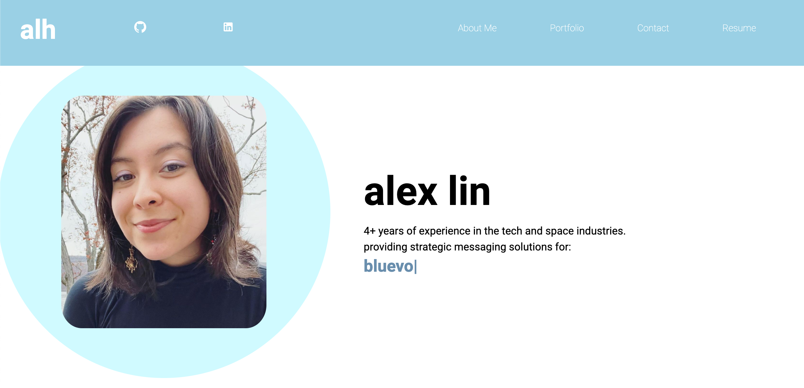

# My React Portfolio

## What It Does
This portfolio was developed as part of the UC Berkeley Full Stack Development Bootcamp.

## How It Works
Technologies used include: 

* React
* Material UI Core & Icons
* Heroku

## How to Use It
Simply deploy the app on <a href="https://tranquil-fortress-65157.herokuapp.com/">Heroku</a>.

## See It in Action
